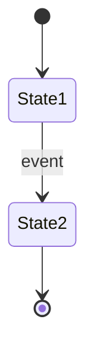

# Feature Spec Authoring

The agent MUST read this skill when generating or updating a `SPEC.md`. All documentation for a plugin lives under `docs/{PluginName}/`.

## When to Use

Activate this skill when:
- Creating specification documentation for a new nopCommerce plugin feature
- Writing a `SPEC.md` with requirements and acceptance criteria
- Updating an existing `SPEC.md`
- Scaffolding a new `docs/{ProjectName}/features/` tree

## How to Use

### Step 1 — Identify the Project and Features

Determine:
- The plugin/project name (creates the root folder under `docs\`)
- The list of distinct features that need specs
- Which features are cross-cutting and share a domain context

### Step 2 — Create the Folder Structure

Each plugin/project gets one subfolder:

```
docs/
  {ProjectName}/
    features/                 # Feature specs (1 folder per feature)
      {feature-name}/
        SPEC.md               # Always uppercase
```

Naming rules:

| Item | Convention | Example |
|---|---|---|
| Project folder | PascalCase | `BusinessCentralConnector` |
| Feature folder | kebab-case | `product-sync` |
| Spec file | `SPEC.md` | `SPEC.md` |

### Step 3 — Create the Feature Spec (`features/{name}/SPEC.md`)

A SPEC.md defines *what* the feature must do — not how. Write the sections in this order:

```markdown
# Feature: {Human-Readable Feature Name}

## Revision History

| Version | Date       | Author | Changes          |
|---------|------------|--------|------------------|
| 1.0     | YYYY-MM-DD | —      | Initial draft    |

## Overview

### Purpose
{One sentence: why this feature exists and what business problem it solves.}

### Background
{1–2 paragraphs: context about the integration, pipeline phases, how this feature
fits into the larger system.}

### Scope
{Bullet list of what this spec covers.}

### Out of Scope
{Bullet list of what this spec intentionally does NOT cover, to prevent scope creep.}

### Actors
- **{Actor1}** — {role description}
- **{Actor2}** — {role description}
- **System** — {scheduled task / background process names}

## Glossary

| Term | Definition |
|---|---|
| {Term} | {Precise definition as used in this spec} |

## Dependencies & Assumptions

- **Depends on:** {feature, table, external system, etc.}
- **Assumes:** {assumption about data, environment, configuration, etc.}

## Data Model

### {EntityName}

| Column | Type | Constraints | Notes |
|---|---|---|---|
| `{ColumnName}` | {SQL_TYPE} | {PK, FK, NOT NULL, DEFAULT, etc.} | {Description} |

### Enumerations

| Enum | Values | Description |
|---|---|---|
| `{EnumName}` | {Value1, Value2, ...} | {What it represents} |

### State Diagram



## Requirements

### Functional — API

- **REQ-{FEAT}-001:** The system SHALL {single testable behavior}.
- **REQ-{FEAT}-002:** The system SHALL {single testable behavior}.

### Functional — Background Processing

- **REQ-{FEAT}-010:** The system SHALL {single testable behavior}.

### Functional — Admin UI

- **REQ-{FEAT}-020:** The system SHALL {single testable behavior}.

### Data Requirements

- **REQ-{FEAT}-030:** The system SHALL {single testable behavior}.

### Non-Functional Requirements

- **REQ-{FEAT}-040:** The system SHALL {single testable behavior}.

## Acceptance Criteria

- [ ] **[REQ-{FEAT}-001]** GIVEN {precondition}
      WHEN {action is performed}
      THEN {expected observable result}
- [ ] **[REQ-{FEAT}-002]** GIVEN {precondition}
      WHEN {action is performed}
      THEN {expected observable result}

## Appendix A: Implementation Reference

> **Note:** This section is informational and not part of the normative specification.

- `{relative/path/File.cs}` — {brief description}
- `{relative/path/IFooService.cs, FooService.cs}` — {description}
```

---

#### Revision History
- One row per version
- Include version number, date, author, and a brief change summary
- Initial draft is version 1.0

#### Overview
- **Purpose:** A single sentence stating why the feature exists
- **Background:** 1–2 paragraphs of context — integration details, pipeline phases, how the feature fits into the larger system
- **Scope:** Bullet list of what the spec covers
- **Out of Scope:** Bullet list of what the spec intentionally excludes — prevents scope creep
- **Actors:** Each actor on its own bullet with role in em-dash format

#### Glossary
- Define all domain-specific terms used in the spec (e.g., "stale session", "delta sync", "batch")
- Each term gets a precise, unambiguous definition
- Include at least 3–5 terms; add more as needed

#### Dependencies & Assumptions
- List external systems, features, tables, or services this feature depends on
- State assumptions about data format, environment, configuration, or caller behavior
- Use `**Depends on:**` and `**Assumes:**` prefixes for clarity

#### Data Model
- **Entity tables:** Full schema with Column, Type, Constraints, and Notes
- **Enumerations:** Table listing enum name, all values, and description
- **State Diagram:** Mermaid `stateDiagram-v2` showing lifecycle transitions — critical for any feature with state-machine behavior
- Backtick-quote all identifiers (column names, enum names, field names)
- Omit the State Diagram sub-section if the feature has no state transitions

#### Requirements

**Format:**
- Use stable identifiers: `REQ-{FEAT}-NNN` where `{FEAT}` is a short feature abbreviation (e.g., `SSM` for Sync Session Management)
- `{FEAT}` prefix prevents ID collision across different feature specs
- Number ranges by category: API = 001–009, Background = 010–019, Admin UI = 020–029, Data = 030–039, NFR = 040–049
- `SHALL` must be uppercase (RFC 2119)

**Granularity — one requirement = one testable behavior:**
- Do NOT bundle multiple behaviors into a single requirement
- If a requirement covers different HTTP status codes for different failure modes, split it into separate requirements
- If a requirement specifies an endpoint AND its default values AND its optional fields, split them
- A good test: if you need the word "AND" to describe the requirement, consider splitting

**Categorization:**
- Group requirements under the appropriate sub-section
- Omit any sub-section that has no requirements (e.g., skip `Non-Functional` if there are none)
- Categories: `Functional — API`, `Functional — Background Processing`, `Functional — Admin UI`, `Data Requirements`, `Non-Functional Requirements`

**Example of splitting a coarse requirement:**

❌ Too coarse:
```markdown
- **REQ-SSM-001:** The system SHALL accept POST /api/session/start with
  sessionId (required), syncType (required, default Full), totalItems,
  batchSize, totalBatches and create a session in InProgress status.
```

✅ Split into testable behaviors:
```markdown
- **REQ-SSM-001:** The system SHALL accept POST /api/session/start with
  required fields sessionId and syncType.
- **REQ-SSM-002:** The system SHALL default syncType to Full when not
  provided in the session start payload.
- **REQ-SSM-003:** The system SHALL create a SyncSession record with
  Status=InProgress upon successful session start.
```

#### Acceptance Criteria

**Format — Given/When/Then (Gherkin):**
- Every criterion MUST use the `GIVEN ... WHEN ... THEN ...` structure
- `GIVEN` establishes the precondition or system state
- `WHEN` describes the action or event
- `THEN` describes the expected observable result
- Use concrete values: HTTP status codes, enum values, field names, default intervals

**Traceability:**
- Every criterion MUST be tagged with the requirement ID(s) it validates: `**[REQ-{FEAT}-NNN]**`
- Every requirement MUST have at least one acceptance criterion
- A single criterion MAY validate multiple requirements by listing multiple tags: `**[REQ-SSM-001, REQ-SSM-003]**`

**Coverage:**
- Include positive (happy path), negative (error/rejection), and edge-case criteria
- For state-machine features, include criteria for every valid transition AND at least one invalid transition

**Example:**
```markdown
- [ ] **[REQ-SSM-001]** GIVEN a JSON payload with sessionId="abc-123" and syncType="Full"
      WHEN POST /api/bcsync/session/start is called
      THEN HTTP 201 is returned AND a SyncSession record exists with Status=InProgress

- [ ] **[REQ-SSM-002]** GIVEN a JSON payload with sessionId="abc-123" and no syncType field
      WHEN POST /api/bcsync/session/start is called
      THEN HTTP 201 is returned AND the created session has syncType=Full

- [ ] **[REQ-SSM-004]** GIVEN the BC plugin setting is disabled
      WHEN POST /api/bcsync/session/start is called
      THEN HTTP 400 is returned with error message "Plugin is disabled"
```

#### Appendix A: Implementation Reference
- This section is **non-normative** — it is informational and not part of the specification
- List 12–20 file paths relative to the plugin root
- Use `—` (em-dash) to separate path from description
- Interfaces and implementations listed together: `IFooService.cs, FooService.cs`
- Cover: controllers, services, tasks, domains, models, views, factories, infrastructure

### Step 4 — Cross-Reference with Context Docs

- Feature specs must mention dependent features in their Overview section
- Specs should reference the corresponding context file(s) for implementation-level detail
- Cross-reference entities (like a mapping table) must be mentioned in all relevant specs

---

## Guardrails

### Structure & Naming
- ALWAYS create the folder structure before writing individual specs
- ALWAYS use kebab-case for feature folders
- ALWAYS name spec files `SPEC.md` (uppercase)
- ALWAYS place all documentation under `docs/{PluginName}/`

### Requirements
- ALWAYS use `SHALL` (uppercase) for requirements language (RFC 2119)
- ALWAYS use stable requirement IDs in the format `REQ-{FEAT}-NNN`
- ALWAYS assign number ranges by category: API 001–009, Background 010–019, Admin UI 020–029, Data 030–039, NFR 040–049
- ENSURE one requirement = one testable behavior — split coarse requirements
- ENSURE requirements are grouped under the correct category sub-section
- OMIT empty category sub-sections rather than leaving them blank

### Acceptance Criteria
- ALWAYS write acceptance criteria in Given/When/Then (Gherkin) format
- ALWAYS tag every acceptance criterion with the requirement ID(s) it validates
- ENSURE every requirement has at least one acceptance criterion
- ENSURE coverage includes positive, negative, and edge-case scenarios
- INCLUDE concrete values: HTTP status codes, default intervals, enum values, field names

### Traceability
- ENSURE bidirectional traceability: every REQ has ≥1 AC, every AC references ≥1 REQ
- VERIFY traceability as a final step before completing any SPEC.md

### Spec Sections
- ALWAYS include: Revision History, Overview (with Purpose, Background, Scope, Out of Scope, Actors), Glossary, Dependencies & Assumptions, Data Model, Requirements, Acceptance Criteria
- ALWAYS include Appendix A: Implementation Reference with the non-normative disclaimer
- INCLUDE the Data Model State Diagram sub-section only for features with state transitions
- OMIT Glossary or Dependencies & Assumptions only if genuinely not applicable (rare)

### Content Boundaries
- NEVER place implementation detail (method signatures, SQL types) in normative spec sections — those belong in context files or Appendix A
- ALWAYS use `—` (em-dash) separator between file path and description in Appendix A
